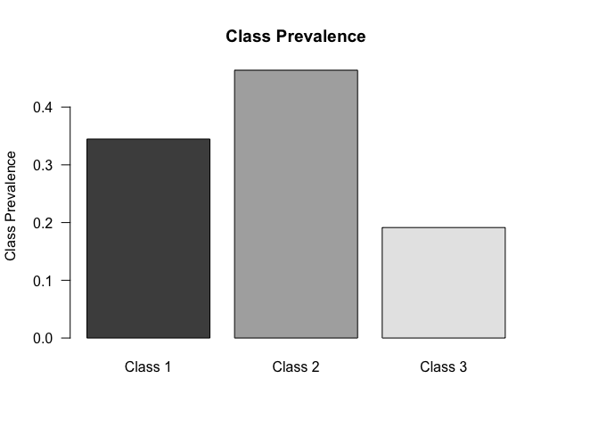
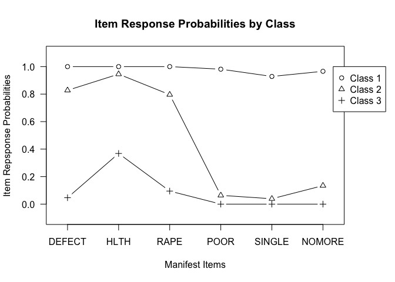
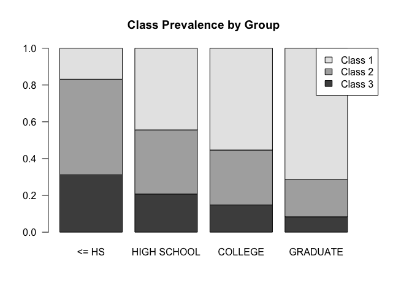
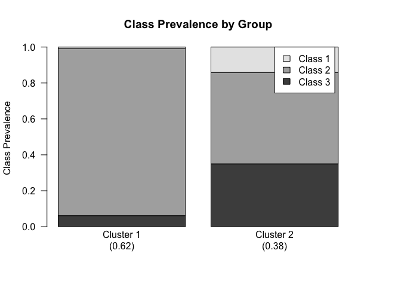

<!-- README.md is generated from README.Rmd. Please edit that file -->

# glca

<!-- badges: start -->

[](https://r-pkg.org/pkg/glca)
[](https://r-pkg.org/pkg/glca)
[](https://r-pkg.org/pkg/glca)

<!-- badges: end -->

Fits latent class analysis (LCA) including group variable and
covariates. The group variable can be handled either by multilevel LCA
described in Vermunt (2003) <DOI:10.1111/j.0081-1750.2003.t01-1-00131.x>
or standard LCA at each level of group variable. The covariates can be
incorporated in the form of logistic regression (Bandeen-Roche et al.
(1997) <DOI:10.1080/01621459.1997.10473658>).

## Installation

You can install the released version of glca from
[CRAN](https://CRAN.R-project.org) with:

``` r
install.packages("glca")
```

And the development version from [GitHub](https://github.com/) with:

``` r
# install.packages("devtools")
devtools::install_github("kim0sun/glca")
```

## Example

``` r
library(glca)
data("gss12")
# LCA
lca = glca(item(DEFECT, HLTH, RAPE, POOR, SINGLE, NOMORE) ~ 1,
            data = gss12, nclass = 3, verbose = FALSE)
summary(lca)
#> 
#> Call:
#> glca(formula = item(DEFECT, HLTH, RAPE, POOR, SINGLE, NOMORE) ~ 
#>     1, data = gss12, nclass = 3, verbose = FALSE)
#> 
#> Model : Standard LCA 
#> Number of latent classes : 3 
#> 
#> Mean Prevalence for latent classes for each group:
#>     Class 1 Class 2 Class 3
#> ALL 0.44226 0.19471 0.36303
#> 
#> Number of parameters : 20 
#> 
#> log-likelihood : -1349.348 
#>      G-squared : 52.53695 
#>            AIC : 2738.697 
#>            BIC : 2828.693
#> 
#> Response numbering:
#>        Y = 1 Y = 2
#> DEFECT   YES    NO
#> HLTH     YES    NO
#> RAPE     YES    NO
#> POOR     YES    NO
#> SINGLE   YES    NO
#> NOMORE   YES    NO
#> 
#> Estimated model parameters :
#> Gamma :
#>     Class 1 Class 2 Class 3
#> ALL  0.4423  0.1947   0.363
#> 
#> Rho (Y = 1) :
#>         DEFECT   HLTH   RAPE   POOR SINGLE NOMORE
#> Class 1 0.9845 1.0000 0.9901 0.9431 0.9394 0.9984
#> Class 2 0.0626 0.4481 0.0622 0.0000 0.0000 0.0157
#> Class 3 0.8281 0.9782 0.8522 0.1115 0.0514 0.0985
#> Rho (Y = 2) :
#>         DEFECT   HLTH   RAPE   POOR SINGLE NOMORE
#> Class 1 0.0155 0.0000 0.0099 0.0569 0.0606 0.0016
#> Class 2 0.9374 0.5519 0.9378 1.0000 1.0000 0.9843
#> Class 3 0.1719 0.0218 0.1478 0.8885 0.9486 0.9015
plot(lca)
```



``` r

# Multiple-group LCA (MGLCA)
mglca = glca(item(DEFECT, HLTH, RAPE, POOR, SINGLE, NOMORE) ~ 1,
             group = DEGREE, data = gss12, nclass = 3, verbose = FALSE)
summary(mglca)
#> 
#> Call:
#> glca(formula = item(DEFECT, HLTH, RAPE, POOR, SINGLE, NOMORE) ~ 
#>     1, group = DEGREE, data = gss12, nclass = 3, verbose = FALSE)
#> 
#> Model : Multigroup LCA 
#> Number of latent classes : 3 
#> 
#> Mean Prevalence for latent classes for each group:
#>             Class 1 Class 2 Class 3
#> <= HS       0.27011 0.30479 0.42510
#> HIGH SCHOOL 0.38661 0.20474 0.40865
#> COLLEGE     0.51168 0.15035 0.33797
#> GRADUATE    0.74073 0.15689 0.10238
#> 
#> Number of parameters : 26 
#> Number of groups : 4 
#> 
#> log-likelihood : -1324.764 
#>      G-squared : 132.2912 
#>            AIC : 2701.527 
#>            BIC : 2818.522
#> 
#> Response numbering:
#>        Y = 1 Y = 2
#> DEFECT   YES    NO
#> HLTH     YES    NO
#> RAPE     YES    NO
#> POOR     YES    NO
#> SINGLE   YES    NO
#> NOMORE   YES    NO
#> 
#> Estimated model parameters :
#> Gamma :
#>             Class 1 Class 2 Class 3
#> <= HS        0.2701  0.3048  0.4251
#> HIGH SCHOOL  0.3866  0.2047  0.4086
#> COLLEGE      0.5117  0.1503  0.3380
#> GRADUATE     0.7407  0.1569  0.1024
#> 
#> Rho (Y = 1) :
#>         DEFECT   HLTH   RAPE   POOR SINGLE NOMORE
#> Class 1 0.9848 1.0000 0.9902 0.9451 0.9417 0.9978
#> Class 2 0.0715 0.4613 0.0699 0.0000 0.0000 0.0175
#> Class 3 0.8348 0.9792 0.8592 0.1140 0.0527 0.1015
#> Rho (Y = 2) :
#>         DEFECT   HLTH   RAPE   POOR SINGLE NOMORE
#> Class 1 0.0152 0.0000 0.0098 0.0549 0.0583 0.0022
#> Class 2 0.9285 0.5387 0.9301 1.0000 1.0000 0.9825
#> Class 3 0.1652 0.0208 0.1408 0.8860 0.9473 0.8985
plot(mglca)
```



``` r

# Multiple-group LCA with covariate(s) (MGLCR)
mglcr = glca(item(DEFECT, HLTH, RAPE, POOR, SINGLE, NOMORE) ~ SEX,
             group = DEGREE, data = gss12, nclass = 3, verbose = FALSE)
summary(mglcr)
#> 
#> Call:
#> glca(formula = item(DEFECT, HLTH, RAPE, POOR, SINGLE, NOMORE) ~ 
#>     SEX, group = DEGREE, data = gss12, nclass = 3, verbose = FALSE)
#> 
#> Model : Multigroup LCA with Covariates 
#> Number of latent classes : 3 
#> 
#> Mean Prevalence for latent classes for each group:
#>             Class 1 Class 2 Class 3
#> <= HS       0.26927 0.31364 0.41709
#> HIGH SCHOOL 0.38580 0.21045 0.40375
#> COLLEGE     0.51154 0.15513 0.33333
#> GRADUATE    0.74040 0.16202 0.09758
#> 
#> Number of parameters : 28 
#> Number of groups : 4 
#> 
#> log-likelihood : -1321.795 
#>      G-squared : 194.9587 
#>            AIC : 2699.589 
#>            BIC : 2825.583
#> 
#> Response numbering:
#>        Y = 1 Y = 2
#> DEFECT   YES    NO
#> HLTH     YES    NO
#> RAPE     YES    NO
#> POOR     YES    NO
#> SINGLE   YES    NO
#> NOMORE   YES    NO
#> 
#> Estimated model parameters :
#> Beta :
#> Intercepts :
#>                    Class 1/3 Class 2/3
#> Group :<= HS         -0.5249   -0.6160
#> Group :HIGH SCHOOL   -0.1416   -1.0117
#> Group :COLLEGE        0.3260   -1.1454
#> Group :GRADUATE       1.9376    0.1707
#> 
#> Coefficients :
#> Class 1/3 Class 2/3 
#>    0.1774    0.6067 
#> 
#> Rho (Y = 1) :
#>         DEFECT   HLTH   RAPE   POOR SINGLE NOMORE
#> Class 1 0.9848 1.0000 0.9902 0.9457 0.9422 0.9981
#> Class 2 0.0803 0.4714 0.0792 0.0000 0.0000 0.0190
#> Class 3 0.8424 0.9811 0.8662 0.1164 0.0544 0.1030
#> Rho (Y = 2) :
#>         DEFECT   HLTH   RAPE   POOR SINGLE NOMORE
#> Class 1 0.0152 0.0000 0.0098 0.0543 0.0578 0.0019
#> Class 2 0.9197 0.5286 0.9208 1.0000 1.0000 0.9810
#> Class 3 0.1576 0.0189 0.1338 0.8836 0.9456 0.8970
coef(mglcr)
#> Coefficients :
#> 
#> Class 1 / 3 :
#>           Odds Ratio Coefficient  Std. Error  t value  Pr(>|t|)    
#> SEXFEMALE    1.19411     0.17740     0.04866    3.646  0.000296 ***
#> ---
#> Signif. codes:  0 '***' 0.001 '**' 0.01 '*' 0.05 '.' 0.1 ' ' 1
#> 
#> Class 2 / 3 :
#>           Odds Ratio Coefficient  Std. Error  t value  Pr(>|t|)    
#> SEXFEMALE    1.83433     0.60668     0.06391    9.493    <2e-16 ***
#> ---
#> Signif. codes:  0 '***' 0.001 '**' 0.01 '*' 0.05 '.' 0.1 ' ' 1

data("nyts18")
# Multilevel LCA (MLCA)
mlca = glca(item(ECIGT, ECIGAR, ESLT, EELCIGT, EHOOKAH) ~ 1, group = SCH_ID, 
            data = nyts18, nclass = 3, ncluster = 2, verbose = FALSE)
summary(mlca)
#> 
#> Call:
#> glca(formula = item(ECIGT, ECIGAR, ESLT, EELCIGT, EHOOKAH) ~ 
#>     1, group = SCH_ID, data = nyts18, nclass = 3, ncluster = 2, 
#>     verbose = FALSE)
#> 
#> Model : Multilevel LCA 
#> Number of latent classes : 3 
#> Number of latent clusters : 2 
#> 
#> Mean Prevalence for latent clusters:
#> Cluster 1 Cluster 2 
#>   0.62012   0.37988 
#> 
#> Mean Prevalence for latent classes:
#>           Class 1 Class 2 Class 3
#> Cluster 1 0.00877 0.92994 0.06129
#> Cluster 2 0.14126 0.50889 0.34985
#> 
#> 
#> Number of parameters : 20 
#> Number of groups : 45 
#> 
#> log-likelihood : -1962.45 
#>      G-squared : 773.581 
#>            AIC : 3964.9 
#>            BIC : 4074.167
#> 
#> Response numbering:
#>         Y = 1 Y = 2
#> ECIGT     Yes    No
#> ECIGAR    Yes    No
#> ESLT      Yes    No
#> EELCIGT   Yes    No
#> EHOOKAH   Yes    No
#> 
#> Estimated model parameters :
#> Delta :
#> Cluster 1 Cluster 2 
#>    0.6201    0.3799 
#> 
#> Gamma :
#>           Class 1 Class 2 Class 3
#> Cluster 1  0.0088  0.9299  0.0613
#> Cluster 2  0.1413  0.5089  0.3499
#> 
#> Rho (Y = 1) :
#>          ECIGT ECIGAR   ESLT EELCIGT EHOOKAH
#> Class 1 0.9120 0.9755 0.5621  0.9776  0.5345
#> Class 2 0.0062 0.0043 0.0086  0.0405  0.0057
#> Class 3 0.3436 0.1970 0.1265  0.7780  0.0439
#> Rho (Y = 2) :
#>          ECIGT ECIGAR   ESLT EELCIGT EHOOKAH
#> Class 1 0.0880 0.0245 0.4379  0.0224  0.4655
#> Class 2 0.9938 0.9957 0.9914  0.9595  0.9943
#> Class 3 0.6564 0.8030 0.8735  0.2220  0.9561
plot(mlca)
```



``` r

# MLCA with covariate(s) (MLCR)
# (HOME: level-1 covariate, School_lev: level-2 covariate)
mlcr = glca(item(ECIGT, ECIGAR, ESLT, EELCIGT, EHOOKAH) ~ SCH_LEV, group = SCH_ID,
            data = nyts18, nclass = 3, ncluster = 2, verbose = FALSE)
summary(mlcr)
#> 
#> Call:
#> glca(formula = item(ECIGT, ECIGAR, ESLT, EELCIGT, EHOOKAH) ~ 
#>     SCH_LEV, group = SCH_ID, data = nyts18, nclass = 3, ncluster = 2, 
#>     verbose = FALSE)
#> 
#> Model : Multilevel LCA 
#> Number of latent classes : 3 
#> Number of latent clusters : 2 
#> 
#> Mean Prevalence for latent clusters:
#> Cluster 1 Cluster 2 
#>   0.44544   0.55456 
#> 
#> Mean Prevalence for latent classes:
#>           Class 1 Class 2 Class 3
#> Cluster 1 0.58776 0.29383 0.11841
#> Cluster 2 0.88166 0.09646 0.02188
#> 
#> 
#> Number of parameters : 20 
#> Number of groups : 45 
#> 
#> log-likelihood : -1931.009 
#>      G-squared : 710.6992 
#>            AIC : 3902.018 
#>            BIC : 4011.285
#> 
#> Response numbering:
#>         Y = 1 Y = 2
#> ECIGT     Yes    No
#> ECIGAR    Yes    No
#> ESLT      Yes    No
#> EELCIGT   Yes    No
#> EHOOKAH   Yes    No
#> 
#> Estimated model parameters :
#> Delta :
#> Cluster 1 Cluster 2 
#>    0.4454    0.5546 
#> 
#> Beta (level 1) :
#> $Cluster1
#>             Class 1/3 Class 2/3
#> (Intercept)    0.4899    0.7615
#> 
#> $Cluster2
#>             Class 1/3 Class 2/3
#> (Intercept)    2.1964     1.244
#> 
#> Beta (level 2) :
#>                    Class 1/3 Class 2/3
#> SCH_LEVHigh School    2.6632    0.7118
#> 
#> Rho (Y = 1) :
#>          ECIGT ECIGAR   ESLT EELCIGT EHOOKAH
#> Class 1 0.0033 0.0037 0.0071  0.0347  0.0056
#> Class 2 0.3131 0.1623 0.1183  0.7280  0.0387
#> Class 3 0.8957 0.9687 0.5377  0.9780  0.5007
#> Rho (Y = 2) :
#>          ECIGT ECIGAR   ESLT EELCIGT EHOOKAH
#> Class 1 0.9967 0.9963 0.9929  0.9653  0.9944
#> Class 2 0.6869 0.8377 0.8817  0.2720  0.9613
#> Class 3 0.1043 0.0313 0.4623  0.0220  0.4993
coef(mlcr)
#> 
#> Level 2 Coefficients :
#> 
#> Class 1 / 3 :
#>                    Odds Ratio Coefficient  Std. Error  t value  Pr(>|t|)    
#> SCH_LEVHigh School    14.3426      2.6632      0.6168    4.318  1.69e-05 ***
#> ---
#> Signif. codes:  0 '***' 0.001 '**' 0.01 '*' 0.05 '.' 0.1 ' ' 1
#> 
#> Class 2 / 3 :
#>                    Odds Ratio Coefficient  Std. Error  t value  Pr(>|t|)
#> SCH_LEVHigh School     2.0377      0.7118      0.6921    1.029     0.304
```
