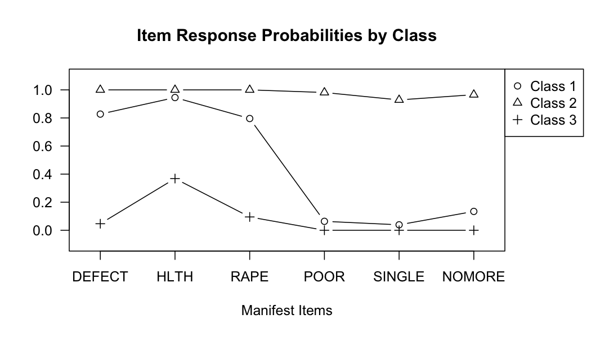
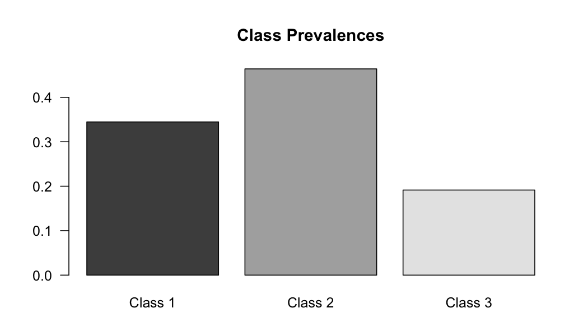
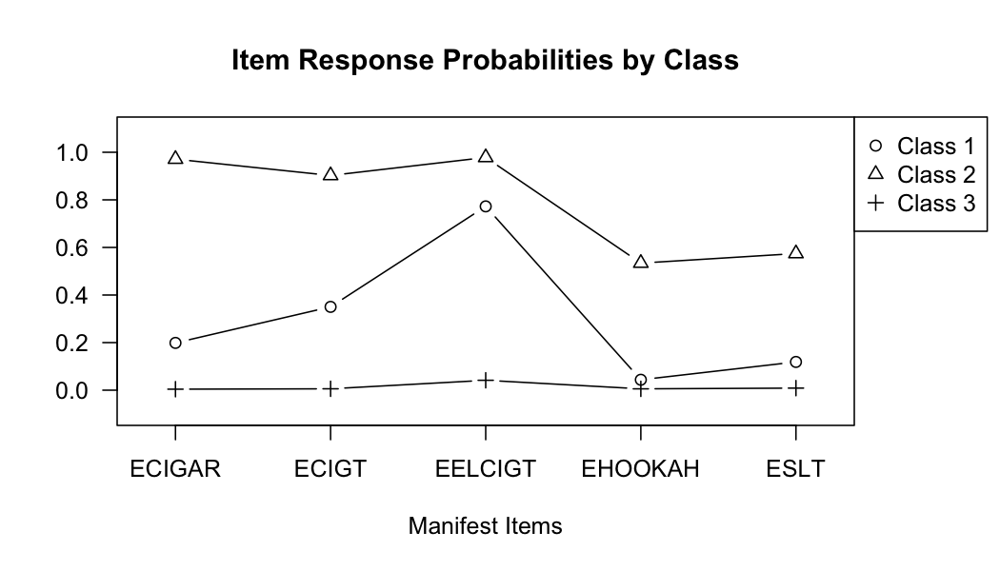
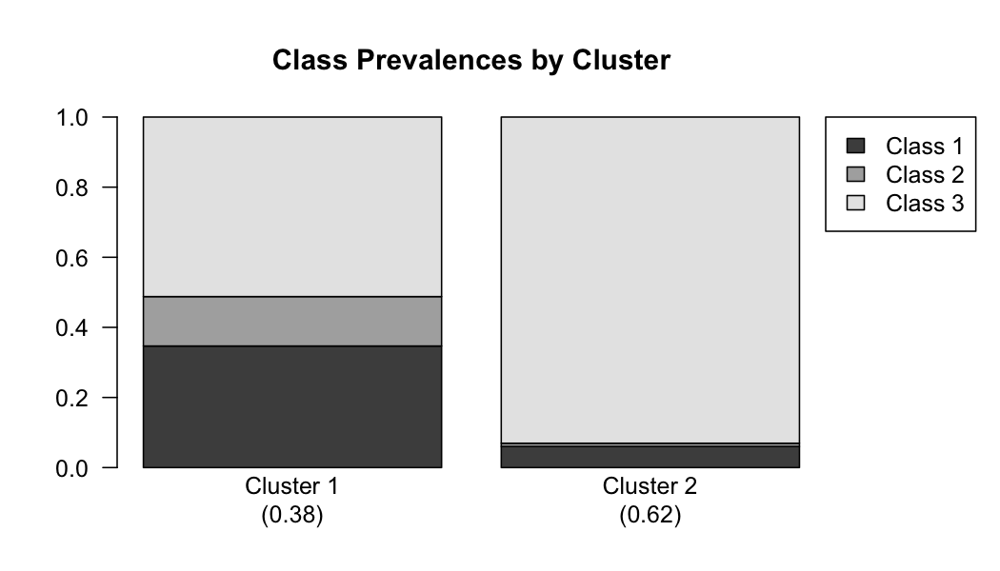

```r
library(glca)
```
## Usage for `glca()`
The main function of this package, called `glca()`, fits a wide range of multiple-group latent class models including fixed-effect and random-effect LCA in order to examine whether the latent structure is identical across groups. The `glca()` function can be called with


```r
glca(formula, group, data, nclass, ncluster, std.err, measure.inv, coeff.inv,
     init.param, n.init, decreasing, testiter, maxiter, eps,
     na.rm, seed, verbose)
```

The function `glca()` uses the formula expression in order to specify a multiple-group latent class model. For example, suppose there are four manifest items, `Y1`, `Y2`, `Y3`, and `Y4` in the dataset. These items must be combined as `item(Y1, Y2, Y3, Y4)` and located on the left hand side of the formula. Without any covariate, the formula definition takes the form:


```r
formula <- item(Y1, Y2, Y3, Y4) ~ 1
```

The item can be specified by the prefix or suffix of the manifest items as follows:


```r
formula <- item(starts.with = "Y") ~ 1
```

Any covariate can be incorporated by replacing  `~ 1` with the desired function of covariates. For example, the npLCR with one level-1 covariate (`X1`) and one level-2 covariate (`Z1`) can be fitted using the following formula:


```r
formula <- item(starts.with = "Y") ~ X1 + Z1
```

It should be noted that `glca()` identifies the type of covariates automatically. The function has following arguments:

| argument    | description                                    |
|:------------|------------------------------------------------|
|`data`       | The input data, `data.frame` or `matrix`, with individuals in rows and group variable, level-1 and level-2 covariates, and individuals’ responses to manifest items in the columns. The data could con- tain multichotomous responses to manifest items. |
|`group`      | Argument that indicates group variable which has the same length as manifest items on the formula. If `group = NULL` (default), standard LCA or LCR is fitted.|
|`nclass`     | Integer scalar specifying the number of latent classes. In the default setting, `nclass = 3`.|
|`ncluster`   | Integer scalar specifying the number of latent clusters (default `ncluster = 0`).|
|`std.err`    | Logical value for whether calculating standard errors for estimates (default `std.err = TRUE`).|
|`measure.inv`| Logical value for whether measurement invariance across groups is assumed (default `measure.inv = TRUE`).|
|`coeff.inv`  | Logical value for whether coefficients for level-1 covariates are identical across groups or latent clusters (default `coeff.inv = TRUE`).|
|`init.param` | A set of model parameters to be used as a user-specified initial values for EM algorithm. It should be list with the named parameters and have same structure of param of the `glca()` output. In default, initial parameters are randomly generated (i.e., default `init.param = NULL`).|
|`n.init`     | Integer scalar specifying the number of randomly generated parameter sets to be used as initial values for EM algorithm in order to avoid local maxima problem (default `n.init = 10`).|
|`testiter`   | Integer scalar specifying the number of iterations in EM algorithm for each initial parameter set in order to select the best initial parameter set. The initial parameter set that provides the largest log-likelihood is selected for main iteration to estimate model parameters (default `testiter = 50`).|
|`maxiter`    | Integer scalar specifying the maximum number of iterations for EM algorithm (default `maxiter = 5000`).|
|`eps`        | A convergence tolerance value. When the largest absolute difference between former estimates and current estimates is less than eps, EM algorithm will stop updating and consider the convergence to be reached (default `eps = 1e-06`).|
|`na.rm`      | Logical value for whether the routine deletes the rows that have at least one missing manifest item. If `na.rm = FALSE` (default), FIML approach will be conducted under MAR condition.|
|`seed`       | In default, the set of initial parameters is drawn randomly. As the same value for seed guarantees the same initial parameters to be drawn, this argument can be used for reproducibility of estimation results.|
|`verbose`    | Logical value indicating whether `glca()` should print the estimation procedure onto the screen (default `verbose = TRUE`).|

The output of `glca()` is `list` or `data.frame` that contains information for model specification and results of the data analysis using the specified model. The function `glca()` returns following

| output      | description                                    |
|:------------|------------------------------------------------|
|`model`      | A `list` containing information on the specified multiple-group latent class models.|
|`var.names`  | A `list` containing names of data.|
|`datalist`   | A `list` of data used for fitting.|
|`param`      | A `list` of parameter estimates.|
|`std.err`    | A `list` of standard errors for param.|
|`coefficient`| A `list` of logistic regression coefficients for latent class prevalences.
|`gof`        | A `list` of goodness-of-fit measures.|
|`convergence`| A `list` containing information on convergence.|
|`posterior`  | For mgLCR, posterior is a `data.frame` of posterior probabilities belonging to specific latent class for each individual. For npLCR, posterior is a `list` containing three type of posterior probabilities; probabilities of belonging to latent cluster for each group, belonging to latent cluster for each latent class, and belonging to latent class for each individual.|

For objects from the `glca()`, generic functions for `print()`, `summary()`, `coef()`, `logLik()`, `reorder()` and `plot()` are available. The generic function `print()` can be accessed with `print(x)` where `x` is an object from the function `glca()`. This function is used to print information from the object x to console. The function calls together with the names of variable, model specification, the number of observations, and the number of parameters used in the analysis.

The function `summary()` is a generic function that is summarizing results from the `glca()`. The function can be called via `summary(x)`. The output of the `summary(x)` has two main components; the first component contains information on model specification, and the second component contains parameter estimates.

Generic functions `coef()` and `logLik()` can also be used. The estimates of regression coefficients and their standard errors of the object `x` from the function `glca()` will be extracted via `coef(x)`. Odds ratios, $t$-values, and their respective $p$-values for the estimated coefficient will also be extracted. The function `logLik()` extracts log-likelihood and degree of freedom for the model which enables to use other statistical R function such as `AIC()` and `BIC()`.

`reorder()` function can be used for `glca` for reordering estimated parameters. Since the latent classes or clusters can be switched according to the initial value of EM algorithm, the order of estimated parameters can be arbitrary. For convenient interpretation of estimated parameters, researchers desire to rearrange the order of latent variables. The ordering can be designated by users (`class.order`, `cluster.order`) and can be determined by the magnitude of the probability of responding the first manifest item with the first option.

A generic function for plotting parameter estimates of the specified model is also available to the user. The user can plot parameters of the object `x` with `plot(x)`. This function returns three types of plots: item-response probabilities, marginal class prevalences, and class prevalences by group or cluster. The plot for item-response probabilities has M manifest items on the `x`-axis, the probability of responding to the $k$th category for the $m$th item on the`y`-axis for $k = 1, \dots , r_m$. If there is a group variable with the argument measure.inv = FALSE in the `glca()` function, separate plot for each group is returned. The plot for marginal class prevalences has latent classes on the `x`-axis, and the probability of belonging to the respective latent class on the y axis. If there is a group variable, additional plot is returned for displaying class prevalences for each group (when mgLCR is fitted) or latent cluster (when npLCR is fitted). This plot has levels of group or latent cluster variable on the `x`-axis, and the conditional probability of belonging to latent classes for each group or latent cluster on the `y`-axis.


## Usage for `gofglca()`

In multiple-group LCA, the first and fundamental step is to select the appropriate number of latent classes and latent clusters. Once the number of latent components are determined, the next step is to assess relative model fit for exploring various group differences in latent structure across groups or latent clusters. The assessment of model fit described in Sections - is implemented into a function named `gofglca()`. The function syntax is


```r
gofglca(x, ..., criteria, test, nboot, maxiter, eps, seed, verbose)
```

and uses following arguments.

| argument    | description                                    |
|:------------|------------------------------------------------|
|`x`          | An output of the `glca()` function. Absolute model fit test will be conducted for the model specified in `x`.|
|`...`        | An optional argument, one or more output objects of the function `glca()`, which enables users to test for relative model fit. Each of these optional objects will be compared to one of other objects, which are specified in this argument.|
|`criteria`   | A character vector specifying which type of information criteria should be returned by the function. Default is to return all types of criteria via `c("logLik", "AIC", "CAIC", "BIC", "entropy")`.|
|`test`       | String that controls which distribution to be used for calculating p-value in hypothesis test. Available options are `"NULL"` (default), `"chisq"` (chi-square distribution), and `"boot"` (bootstrap empirical distribution).
|`nboot`      | The number of bootstrap samples to be generated when `test = "boot"` (default `nboot = 50`).|
|`maxiter`    | Integer scalar specifying the maximum number of EM iterations for each of bootstrap samples (default `maxiter = 500`).|
|`eps`        | A convergence tolerance value used in EM algorithm for each of bootstrap samples (default `eps = 1e-04`).|
|`seed`       | As the same value for seed guarantees the same datasets to be generated, this argument can be used for reproducibility of bootstrap results (default `seed = NULL`).|
|`verbose`    | Logical value indicating whether `gofglca()` should print the assessment procedure onto the screen (default `verbose = TRUE`).|

The function `gofglca()` provides the table for analysis of goodness-of-fit containing information criteria, residual degrees of freedom, $G^2$-statistic, and bootstrap $p$-value for absolute model fit for the designated objects when `test = "boot"`. With optional objects from the function `glca()`, `gofglca()` also provides the table for analysis of deviance given that these objects share the same manifest items. The table for analysis of deviance describes relative model fit using the deviance statistic between two competing models and its $p$-value using distribution specified in test argument.

## Applications
### Attitude toward abortion

The dataset `gss08` taken from the *2008 General Social Survey (Smith et al., 2010)* includes six binary manifest items measuring 355 respondents’ attitudes toward abortion following the strategy suggested by McCutcheon, 1987. For each item, respondents were asked whether abortion should be legalized under various circumstances: a strong chance of serious defect in the baby (`DEFECT`), pregnancy is seriously endangering the woman’s health (`HLTH`), pregnancy as a result of rape (`RAPE`), due to low income, the family cannot afford any more children (`POOR`), woman is unmarried and has no plans to marry the man (`SINGLE`), and woman is married but does not want more children (`NOMORE`). Each item has two possible levels of response (i.e., `"YES"` or `"NO"`). `gss08` also include five covariates: `AGE`, `GENDER`, `RACE`, `DEGREE` and `REGION` of respondents. (`?gss08`)


```r
data("gss08")
str(gss08)
#> 'data.frame':	355 obs. of  11 variables:
#>  $ DEFECT: Factor w/ 2 levels "YES","NO": 1 2 2 1 1 1 1 1 1 1 ...
#>  $ HLTH  : Factor w/ 2 levels "YES","NO": 1 2 2 1 1 1 1 1 1 1 ...
#>  $ RAPE  : Factor w/ 2 levels "YES","NO": 1 2 2 1 1 1 1 1 1 1 ...
#>  $ POOR  : Factor w/ 2 levels "YES","NO": 2 2 2 1 1 1 1 1 1 1 ...
#>  $ SINGLE: Factor w/ 2 levels "YES","NO": 2 2 2 1 1 1 1 1 NA 1 ...
#>  $ NOMORE: Factor w/ 2 levels "YES","NO": 1 2 2 1 1 1 1 NA 1 1 ...
#>  $ AGE   : num  32 21 56 40 62 71 58 36 52 78 ...
#>  $ SEX   : Factor w/ 2 levels "MALE","FEMALE": 1 2 2 1 2 1 2 1 1 2 ...
#>  $ RACE  : Factor w/ 3 levels "WHITE","BLACK",..: 2 2 2 2 1 2 2 1 1 1 ...
#>  $ DEGREE: Factor w/ 4 levels "<= HS","HIGH SCHOOL",..: 2 2 1 4 3 2 3 3 2 3 ...
#>  $ REGION: Factor w/ 9 levels "NEW ENGLAND",..: 2 2 2 2 2 2 2 2 2 2 ...
```

**Selecting the number of latent classes: **
In the first step of the analysis, we conduct a series of standard latent class models to select a number of latent classes. The number of class in the `glca()` function is set to 2, 3, or 4 as following commands. It should be noted that we use 10 sets of randomly generated initial parameters to avoid the problem of local maxima (i.e., `n.init = 10`), and the argument is set as `seed = 1` in the `glca()` function to ensure reproductibility of results unless otherwise noted.


```r
f <- item(DEFECT, HLTH, RAPE, POOR, SINGLE, NOMORE) ~ 1
lca2 <- glca(f, data = gss08, nclass = 2, seed = 1, verbose = FALSE)
lca3 <- glca(f, data = gss08, nclass = 3, seed = 1, verbose = FALSE)
lca4 <- glca(f, data = gss08, nclass = 4, seed = 1, verbose = FALSE)
```


```r
gofglca(lca2, lca3, lca4, test = "boot", seed = 1)
#> Model 1: item(DEFECT, HLTH, RAPE, POOR, SINGLE, NOMORE) ~ 1
#>          nclass: 2
#> Model 2: item(DEFECT, HLTH, RAPE, POOR, SINGLE, NOMORE) ~ 1
#>          nclass: 3
#> Model 3: item(DEFECT, HLTH, RAPE, POOR, SINGLE, NOMORE) ~ 1
#>          nclass: 4
#> 
#> Goodness of Fit Table :
#>    logLik     AIC    CAIC     BIC entropy Res.Df    Gsq Boot p-value
#> 1 -740.10 1506.20 1569.43 1556.43    0.95     50 135.13         0.00
#> 2 -687.45 1414.90 1512.17 1492.17    0.88     43  29.83         0.36
#> 3 -684.19 1422.38 1553.70 1526.70    0.79     36  23.31         0.56
#> 
#> Analysis of Deviance Table :
#>   npar  logLik Df Deviance Boot p-value
#> 1   13 -740.10                         
#> 2   20 -687.45  7   105.31         0.00
#> 3   27 -684.19  7     6.52         0.26
```


The output from the function `gofglca()` comprises of two tables; goodness-of-fit table and analysis-of-deviance table. The former shows model fit criteria such as AIC, CAIC, BIC, and entropy, $G^2$ statistic, and its bootstrap $p$-value for absolute model fit. In this example, the bootstrap $p$-values indicate that the two-class model (Model 1) fits data poorly ($p$-value = 0.00), but the three-class and the four-class models (Model 2 and Model 3) fit data adequately ($p$-value = 0.36 and 0.56, respectively). The latter table displays deviance statistic comparing two competing models and its bootstrap $p$-value for the relative model fit. The null hypothesis in the test for comparing Model 1 and Model 2 (i.e., the fit of the two-class model is not significantly poorer than the fit of the three-class model) should be rejected ($p$-value = 0.00). In the test for comparing Model 2 and Model 3, however, the bootstrap $p$-value (= 0.26) indicates that the fit of the four-class model has not been improved significantly compared to the fit of the three-class model. In addition, the three-class model has the smallest value among these three models in the model fit criteria. Therefore, we can conclude that the three-class model is an appropriate for the `gss08` data.


```r
summary(lca3)
#> 
#> Call:
#> glca(formula = f, data = gss08, nclass = 3, seed = 1, verbose = FALSE)
#> 
#> Manifest items : DEFECT HLTH RAPE POOR SINGLE NOMORE 
#> 
#> Categories for manifest items :
#>        Y = 1 Y = 2
#> DEFECT   YES    NO
#> HLTH     YES    NO
#> RAPE     YES    NO
#> POOR     YES    NO
#> SINGLE   YES    NO
#> NOMORE   YES    NO
#> 
#> Model : Latent class analysis 
#> 
#> Number of latent classes : 3 
#> Number of observations : 352 
#> Number of parameters : 20 
#> 
#> log-likelihood : -687.4486 
#>      G-squared : 29.82695 
#>            AIC : 1414.897 
#>            BIC : 1492.17 
#> 
#> Marginal prevalences for latent classes :
#> Class 1 Class 2 Class 3 
#> 0.34467 0.46396 0.19138 
#> 
#> Class prevalences by group :
#>     Class 1 Class 2 Class 3
#> ALL 0.34467 0.46396 0.19138
#> 
#> Item-response probabilities (Y = 1) :
#>         DEFECT   HLTH   RAPE   POOR SINGLE NOMORE
#> Class 1 0.8275 0.9453 0.7960 0.0638 0.0390 0.1344
#> Class 2 1.0000 1.0000 1.0000 0.9813 0.9284 0.9657
#> Class 3 0.0466 0.3684 0.0949 0.0000 0.0000 0.0000
#> 
#> Item-response probabilities (Y = 2) :
#>         DEFECT   HLTH   RAPE   POOR SINGLE NOMORE
#> Class 1 0.1725 0.0547 0.2040 0.9362 0.9610 0.8656
#> Class 2 0.0000 0.0000 0.0000 0.0187 0.0716 0.0343
#> Class 3 0.9534 0.6316 0.9051 1.0000 1.0000 1.0000
plot(lca3)
```



**Considering group variable and testing the measurement invariance**
As the group information provided in the data, we can consider the multilevel data structure and compare the latent class structure between higher-level units (i.e., groups). The `glca()` function can incorporate group variable by setting group argument as the name of group variable in the data. For example, in order to investigate whether attitudes toward legalizing abortions vary by the final degree of respondents, we may set `DEGREE` as group variable by typing `group = DEGREE` in the `glca()` function . `DEGREE` is coded into four categories (i.e., `"<= HS"`, `"HIGH SCHOOL"`, `"COLLEGE"`, and `"GRADUATE"`) indicating from under high school diploma to graduate degree. Moreover, we can implement the test for measurement invariance across groups using the `glca()` function. The measurement invariance assumption can be adjusted through `measure.inv` argument in `glca()`. The default is `measure.inv = TRUE`, constraining item-response probabilities to be equal across groups. The following commands implement two different tests for group variable: (1) test whether class prevalence is significantly influenced by group variable under the measurement-invariant model; and (2) test whether the measurement models differ across groups.


```r
mglca1 <- glca(f, group = DEGREE, data = gss08, nclass = 3, seed = 1, verbose = FALSE)
mglca2 <- glca(f, group = DEGREE, data = gss08, nclass = 3, measure.inv = FALSE, seed = 1, verbose = FALSE)
gofglca(lca3, mglca1, mglca2, test = "chisq")
#> Model 1: item(DEFECT, HLTH, RAPE, POOR, SINGLE, NOMORE) ~ 1
#>          nclass: 3
#> Model 2: item(DEFECT, HLTH, RAPE, POOR, SINGLE, NOMORE) ~ 1
#>          Group: DEGREE, nclass: 3, measure.inv: TRUE
#> Model 3: item(DEFECT, HLTH, RAPE, POOR, SINGLE, NOMORE) ~ 1
#>          Group: DEGREE, nclass: 3, measure.inv: FALSE
#> 
#> Goodness of Fit Table :
#>    logLik     AIC    CAIC     BIC entropy Res.Df   Gsq
#> 1 -687.45 1414.90 1512.17 1492.17    0.88     43 29.83
#> 2 -672.41 1396.83 1523.28 1497.28    0.88    229 87.85
#> 3 -650.95 1461.89 1850.98 1770.98    0.89    175 44.91
#> 
#> Analysis of Deviance Table :
#>   npar  logLik Df Deviance Pr(>Chi)
#> 1   20 -687.45                     
#> 2   26 -672.41  6    30.07     0.00
#> 3   80 -650.95 54    42.94     0.86
```


Since the model specified in the object `lca3` (Model 1 in the output from the `goflca()` function) is constructed with six binary items, the number of parameters for the saturated models is $26 − 1 = 63$. Therefore, degree of freedom for Model 1 is $63 − 20 = 43$. The models specified in mglca1 and mglca2 (Model 2 and Model 3) are involved with group variable with four categories, and the number of parameters for the saturated models is $26 \times 4 − 1 = 255$. Therefore, degrees of freedom for Model 2 and Model 3 are $255 − 26 = 229$ and $255 − 80 = 175$, respectively. It should be noted that model comparison has been conducted through chi-squares by setting `test = "chisq"` because Model 1 is nested in Model 2, and Model 2 is nested in Model 3. The analysis-of-deviance table provided by the `gofglca()` function shows that the chi-square $p$-value for comparing Model 1 and Model 2 is 0.00, while the $p$-value for comparing Model 2 and Model 3 is 0.86. Hence, we can deduce that the measurement invariance assumption can be assumed, but class prevalences vary across levels of `DEGREE`.

**Testing the equality of coefficients across groups:**
We can further consider the subject-specific covariates which may influence the probability of the individual belonging to a specific class. Covariates such as `AGE`, `RACE`, and `SEX` in the `gss08` dataset can be incorporated into the model specified in `mglca1`. `AGE` is respondent’s age and considered as a numeric variable in the `glca()` function. The respondent’s race, `RACE` has three levels (i.e., `"WHITE"`, `"BLACK"`, and `"OTHER"`), and the respondent’s gender, `SEX` is coded as two categories (i.e., `"MALE"` and `"FEMALE"`). We can easily implement the test for exploring group differences using the `gofglca()` function. For example, the following commands implement two different tests for `SEX`: (1) test whether the class prevalence is significantly influenced by `SEX` under the model where the coefficients are constrained to be identical across groups; and (2) test for assessing group difference in the effect of `SEX` on class prevalence by specifying the model where coefficients are allowed to vary across groups and comparing it to the model where coefficients are constrained to be identical across groups. Since the iteration is initiated with random parameters, the order of class labels can be switched under the identical ML solution. Therefore, the random seed is set as `seed = 3` in the `glca()` function for the model specified in `mglcr1` below to ensure identical class order as provided in Figure 1.


```r
fx <- item(DEFECT, HLTH, RAPE, POOR, SINGLE, NOMORE) ~ SEX
mglcr1 <- glca(fx, group = DEGREE, data = gss08, nclass = 3, seed = 3, verbose = FALSE)
mglcr2 <- glca(fx, group = DEGREE, data = gss08, nclass = 3, coeff.inv = FALSE, seed = 1, verbose = FALSE)
gofglca(mglca1, mglcr1, mglcr2, test = "chisq")
#> Model 1: item(DEFECT, HLTH, RAPE, POOR, SINGLE, NOMORE) ~ 1
#>          Group: DEGREE, nclass: 3, measure.inv: TRUE
#> Model 2: item(DEFECT, HLTH, RAPE, POOR, SINGLE, NOMORE) ~ SEX
#>          Group: DEGREE, nclass: 3, measure.inv: TRUE, coeff.inv: TRUE
#> Model 3: item(DEFECT, HLTH, RAPE, POOR, SINGLE, NOMORE) ~ SEX
#>          Group: DEGREE, nclass: 3, measure.inv: TRUE, coeff.inv: FALSE
#> 
#> Goodness of Fit Table :
#>    logLik     AIC    CAIC     BIC entropy Res.Df    Gsq
#> 1 -672.41 1396.83 1523.28 1497.28    0.88    229  87.85
#> 2 -666.71 1389.42 1525.60 1497.60    0.88    323 149.97
#> 3 -662.04 1392.09 1557.45 1523.45    0.88    317 140.64
#> 
#> Analysis of Deviance Table :
#>   npar  logLik Df Deviance Pr(>Chi)
#> 1   26 -672.41                     
#> 2   28 -666.71  2    11.41     0.00
#> 3   34 -662.04  6     9.33     0.16
```


The models specified in `mglcr1` and `mglcr2` (Model 2 and Model 3 in the output from the `goflca()` function) are involved with an additional covariate, SEX, and the number of possible cases is $26 \times 4 \times 2 − 1 = 511$. However, as only 352 observations are used for the analysis, the number of parameters for the saturated model becomes $352 − 1 = 351$. Therefore, degrees of freedom for Model  2 and Model 3 are $351 − 28 = 323$ and $351 − 34 = 317$, respectively. The analysis-of-deviance table provided by the `gofglca()` function shows that SEX has a significant impact on the class prevalence ($p$-value = 0.00) when we compare Model 1 with Model 2. However, the model without any constraint on coefficients (Model 3) is not significantly superior to Model 2 ($p$-value = 0.16), indicating that the impact of `SEX` is not group specific. Note that Model 2 is mathematically equivalent to the standard LCR with covariates `DEGREE` and `SEX` without the interaction terms, but Model 2 is more intuitive and useful configuration when comparison of latent structures by group is a major concern.

**Summarizing the results from the selected model:**
Based on the previous analysis, we can conclude that measurement models are equivalent across groups (i.e., measurement invariance assumption is satisfied) in the three-class latent class model. In addition, there is a significant effect of SEX on the class prevalence, but there is no group difference in the amount of effect.

Figure 1 displays the estimated parameters from the selected model specified in `mglcr1` using the command `plot(mglcr1)`. The line graph in Figure 1 displays the estimated item-response probabilities. We can see that the identified three classes are clearly distinguished by item-response probabilities. Class 1 represents individuals who are in favor of all the six reasons for abortion, while Class 3 represents those who consistently oppose all the six reasons. Individuals in Class 2 seem to distinguish between favoring the first three reasons (i.e., `DEFECT`, `HLTH`, and `RAPE`) and opposing the last three reasons (i.e., `POOR`, `SINGLE`, and `NOMORE`) for abortion. The first bar graph in Figure 1 describes the estimated marginal class prevalences, and the second bar graph displays the estimated class prevalences for each category of group variable. The values in parentheses printed in the `x`-axis are the group prevalences. Figure 1 displays that the class prevalence varies across groups, and the respondents with higher degrees are more advocate for legalizing abortion than those with lower degrees. The covariate effect can be confirmed through the Wald test for each of estimated odds ratios and coefficient by the command `coef(mglcr1)`.

The `SEX` coefficient results the same, while the intercept determining the class prevalence differs across groups in the selected model. To avoid redundancy and save space, only the results of the `SEX` coefficient are displayed as follows, but the entire output of the object can be displayed by the command `summary(mglcr1)` in the R console.


```r
coef(mglcr1)
#> Coefficients :
#> 
#> Class 1 / 3 :
#>           Odds Ratio Coefficient  Std. Error  t value  Pr(>|t|)    
#> SEXFEMALE    0.32824    -1.11400     0.09062   -12.29    <2e-16 ***
#> ---
#> Signif. codes:  0 '***' 0.001 '**' 0.01 '*' 0.05 '.' 0.1 ' ' 1
#> 
#> Class 2 / 3 :
#>           Odds Ratio Coefficient  Std. Error  t value  Pr(>|t|)    
#> SEXFEMALE    0.35678    -1.03064     0.09971   -10.34    <2e-16 ***
#> ---
#> Signif. codes:  0 '***' 0.001 '**' 0.01 '*' 0.05 '.' 0.1 ' ' 1
summary(mglcr1)
#> 
#> Call:
#> glca(formula = fx, group = DEGREE, data = gss08, nclass = 3, 
#>     seed = 3, verbose = FALSE)
#> 
#> Manifest items : DEFECT HLTH RAPE POOR SINGLE NOMORE 
#> Grouping variable : DEGREE 
#> Covariates (Level 1) : SEX 
#> 
#> Categories for manifest items :
#>        Y = 1 Y = 2
#> DEFECT   YES    NO
#> HLTH     YES    NO
#> RAPE     YES    NO
#> POOR     YES    NO
#> SINGLE   YES    NO
#> NOMORE   YES    NO
#> 
#> Model : Multiple-group latent class analysis 
#> 
#> Number of latent classes : 3 
#> Number of groups : 4 
#> Number of observations : 352 
#> Number of parameters : 28 
#> 
#> log-likelihood : -666.7097 
#>      G-squared : 149.9656 
#>            AIC : 1389.419 
#>            BIC : 1497.601 
#> 
#> Marginal prevalences for latent classes :
#> Class 1 Class 2 Class 3 
#> 0.46144 0.33996 0.19860 
#> 
#> Class prevalences by group :
#>             Class 1 Class 2 Class 3
#> <= HS       0.16848 0.51010 0.32143
#> HIGH SCHOOL 0.44386 0.34339 0.21275
#> COLLEGE     0.55347 0.29616 0.15036
#> GRADUATE    0.71183 0.20237 0.08580
#> 
#> Logistic regression coefficients :
#> Group : <= HS 
#>             Class 1/3 Class 2/3
#> (Intercept)    0.0811    1.1445
#> SEXFEMALE     -1.1140   -1.0306
#> 
#> Group : HIGH SCHOOL 
#>             Class 1/3 Class 2/3
#> (Intercept)     1.424    1.1261
#> SEXFEMALE      -1.114   -1.0306
#> 
#> Group : COLLEGE 
#>             Class 1/3 Class 2/3
#> (Intercept)    2.0173    1.3487
#> SEXFEMALE     -1.1140   -1.0306
#> 
#> Group : GRADUATE 
#>             Class 1/3 Class 2/3
#> (Intercept)    2.6492    1.3620
#> SEXFEMALE     -1.1140   -1.0306
#> 
#> Item-response probabilities (Y = 1) :
#>         DEFECT   HLTH   RAPE   POOR SINGLE NOMORE
#> Class 1 1.0000 1.0000 1.0000 0.9836 0.9309 0.9682
#> Class 2 0.8342 0.9488 0.8086 0.0700 0.0440 0.1409
#> Class 3 0.0649 0.3825 0.0989 0.0000 0.0000 0.0000
#> 
#> Item-response probabilities (Y = 2) :
#>         DEFECT   HLTH   RAPE   POOR SINGLE NOMORE
#> Class 1 0.0000 0.0000 0.0000 0.0164 0.0691 0.0318
#> Class 2 0.1658 0.0512 0.1914 0.9300 0.9560 0.8591
#> Class 3 0.9351 0.6175 0.9011 1.0000 1.0000 1.0000
```

The estimated coefficients for `SEX` and their odds ratios show that females are less advocate for legalizing abortion compared to their male counterparts.

### Tobacco smoking behavior

The dataset `nyts18` comprises five dichotomized manifest items on the life-time experience of several types of tobacco including cigarettes (`ECIGT`), cigars (`ECIGAR`), chewing tobacco/snuff/or dip (`ESLT`), electronic cigarettes (`EELCIGT`), and hookah or water pipe (`EHOOKAH`) taken from the *National Youth Tobacco Survey 2018* (*NYTS 2018*, <https://www.cdc.gov/tobacco/data_statistics/surveys/nyts/>). The sample considered in this study includes 1,743 non-Hispanic white students from 45 schools. The number of sampled students from each school is in the range of 30 to 50. The school membership can be identified by `SCH_ID` and each school is classified as either middle or high school (`SCH_LEV`). (`?nyts18`)

According to socioecological models, patterns of adolescent tobacco smoking are best understood as embedded within social contexts. These social contexts can be either proximal in terms of individuals and peer groups or more distal in terms of schools and community. Socioecological models suggest that students within the same school often share common socio-economic status (SES) and cultural characteristics that may cause different tobacco smoking patterns compared to students attending other schools. However, reflecting school (group) effect in an mgLCR is less likely to provide a meaningful summary because there are too many groups, that is, 45 schools in the `nyts18` dataset. In this case, npLCR would be more appropriate model to investigate group difference in terms of a small number of latent clusters of schools.


```r
data("nyts18")
str(nyts18)
#> 'data.frame':	1734 obs. of  8 variables:
#>  $ ECIGT  : Factor w/ 2 levels "Yes","No": 2 2 2 2 2 2 2 2 2 2 ...
#>  $ ECIGAR : Factor w/ 2 levels "Yes","No": 2 1 2 2 2 1 2 2 2 2 ...
#>  $ ESLT   : Factor w/ 2 levels "Yes","No": 2 2 2 2 2 2 2 2 2 2 ...
#>  $ EELCIGT: Factor w/ 2 levels "Yes","No": 2 1 2 2 2 1 2 2 2 2 ...
#>  $ EHOOKAH: Factor w/ 2 levels "Yes","No": 2 2 2 2 2 2 2 2 2 2 ...
#>  $ SEX    : Factor w/ 2 levels "Male","Female": 2 1 1 1 1 2 1 2 1 2 ...
#>  $ SCH_ID : Factor w/ 45 levels "d3c3dc","12d5ad",..: 11 11 11 11 11 11 11 11 11 11 ...
#>  $ SCH_LEV: Factor w/ 2 levels "High School",..: 1 1 1 1 1 1 1 1 1 1 ...
```

**Selecting the number of latent classes**:
Prior to conducting npLCR, it is necessary to determine the number of level-1 latent classes. Similar to the previous example, the two-, three-, and four-class standard LCA models can be fitted and compared by the `gofglca()` function as follow:


```r
f <- item(starts.with = "E") ~ 1
lca2 <- glca(f, data = nyts18, nclass = 2, seed = 1, verbose = FALSE)
lca3 <- glca(f, data = nyts18, nclass = 3, seed = 1, verbose = FALSE)
lca4 <- glca(f, data = nyts18, nclass = 4, seed = 1, verbose = FALSE)

gofglca(lca2, lca3, lca4, test = "boot", seed = 1)
#> Model 1: item(starts.with = "E") ~ 1
#>          nclass: 2
#> Model 2: item(starts.with = "E") ~ 1
#>          nclass: 3
#> Model 3: item(starts.with = "E") ~ 1
#>          nclass: 4
#> 
#> Goodness of Fit Table :
#>     logLik     AIC    CAIC     BIC entropy Res.Df   Gsq Boot p-value
#> 1 -2119.91 4261.83 4332.87 4321.87    0.92     20 96.48         0.00
#> 2 -2086.86 4207.71 4317.50 4300.50    0.87     14 30.37         0.28
#> 3 -2082.87 4211.74 4360.28 4337.28    0.82      8 22.40         0.78
#> 
#> Analysis of Deviance Table :
#>   npar   logLik Df Deviance Boot p-value
#> 1   11 -2119.91                         
#> 2   17 -2086.86  6    66.11          0.0
#> 3   23 -2082.87  6     7.97          0.1
```


The output of the `gofglca()` function indicates that the three-class and the four-class models are adequate in terms of absolute model fit ($p$-value = 0.28 and 0.78, respectively), but the three-class LCA provides the lowest values in information criteria. For the relative model fit, the two-class LCA is rejected ($p$-value = 0.00) on comparison with the three-class LCA using the bootstrap. However, the three-class is not rejected ($p$-value = 0.10) on comparison with the four-class model. Thus, it seems to be reasonable to select the three-class LCA model for the `nyts18` dataset.

**Selecting the number of latent clusters**:
Now, an npLCR can be implemented by adding SCH_ID as group variable and specifying the number of latent clusters (i.e., level-2 latent classes) using the `ncluster` argument in the `glca()` function. The two-, three-, and four-cluster npLCR with three latent classes are fitted and compared using the following commands:


```r
nplca2 <- glca(f, group = SCH_ID, data = nyts18, nclass = 3, ncluster = 2, seed = 1, verbose = FALSE)
nplca3 <- glca(f, group = SCH_ID, data = nyts18, nclass = 3, ncluster = 3, seed = 1, verbose = FALSE)
nplca4 <- glca(f, group = SCH_ID, data = nyts18, nclass = 3, ncluster = 4, seed = 1, verbose = FALSE)

gofglca(lca3, nplca2, nplca3, nplca4, test = "boot", seed = 1)
#> Model 1: item(starts.with = "E") ~ 1
#>          nclass: 3
#> Model 2: item(starts.with = "E") ~ 1
#>          Group: SCH_ID, nclass: 3, ncluster: 2
#> Model 3: item(starts.with = "E") ~ 1
#>          Group: SCH_ID, nclass: 3, ncluster: 3
#> Model 4: item(starts.with = "E") ~ 1
#>          Group: SCH_ID, nclass: 3, ncluster: 4
#> 
#> Goodness of Fit Table :
#>     logLik     AIC    CAIC     BIC entropy Res.Df    Gsq Boot p-value
#> 1 -2086.86 4207.71 4317.50 4300.50    0.87     14  30.37         0.20
#> 2 -1955.49 3950.97 4080.14 4060.14    0.84   1419 765.73         0.08
#> 3 -1938.73 3923.46 4072.00 4049.00    0.84   1416 732.22         0.22
#> 4 -1938.30 3928.60 4096.51 4070.51    0.84   1413 731.35         0.24
#> 
#> Analysis of Deviance Table :
#>   npar   logLik Df Deviance Boot p-value
#> 1   17 -2086.86                         
#> 2   20 -1955.49  3   262.74         0.00
#> 3   23 -1938.73  3    33.51         0.00
#> 4   26 -1938.30  3     0.87         0.42
```


The goodness-of-fit table shows that the three-cluster model (Model 3) has the smallest values in information criteria among others, and the bootstrap $p$-value (= 0.22) indicates that this model is appropriate for the data. The analysis-of-deviance table shows that group effect is significant as Model 1 has better fit than Model 2 ($p$-value = 0.00). In addition, the three-cluster model (Model 3) has better fit than the two-cluster model (Model 2, $p$-value = 0.00), but there is insignificant difference between the three- and four-cluster models (Model 3 and Model 4) in the model fit ($p$-value = 0.42). Therefore, we can conclude that the three-cluster model is most appropriate among others.

**Testing the equality of coefficients for level-1 covariates across groups:**
Covariates can be incorporated into npLCR using the `glca()` function; not only the subject-specific (i.e., level-1) covariates (e.g., `SEX`) but also the group-specific (i.e., level-2) covariates (e.g., `SCH_LEV`). As shown in the previous example, subject-specific covariates are constrained to be equal across latent clusters by default (i.e., `coeff.inv = TRUE`). The chi-square LRT test for checking the equality of coefficients for level-1 covariate, `SEX` can be conducted using the `gofglca()` function as follows:


```r
fx <- item(starts.with = "E") ~ SEX
nplcr1 <- glca(fx, group = SCH_ID, data = nyts18, nclass = 3, ncluster = 2, seed = 1, verbose = FALSE)
nplcr2 <- glca(fx, group = SCH_ID, data = nyts18, nclass = 3, ncluster = 2, seed = 1, coeff.inv = FALSE, verbose = FALSE)
nplcr.gof <- gofglca(nplca3, nplcr1, nplcr2, test = "chisq")
nplcr.gof$dtable
#>   npar    logLik Df Deviance     Pr(>Chi)
#> 2   22 -1951.879 NA       NA           NA
#> 1   23 -1938.731  1   26.294 2.931509e-07
#> 3   24 -1949.498  1  -21.533 1.000000e+00
```

Note that typing `nplca.gof$dtable` into the R console will return the analysis-of-deviance table. Considering the $p$-values given in the table above, the equality of SEX effect can be assumed. Therefore, we conclude that the model specified in `nplcr1` should be selected for the `nyts18` dataset.


```r
coef(nplcr1)
#> 
#> Level 1 Coefficients :
#> 
#> Class 1 / 3 :
#>           Odds Ratio Coefficient  Std. Error  t value  Pr(>|t|)
#> SEXFemale    1.05946     0.05776     0.16491     0.35     0.726
#> 
#> Class 2 / 3 :
#>           Odds Ratio Coefficient  Std. Error  t value  Pr(>|t|)   
#> SEXFemale     1.9301      0.6576      0.2071    3.176   0.00152 **
#> ---
#> Signif. codes:  0 '***' 0.001 '**' 0.01 '*' 0.05 '.' 0.1 ' ' 1
plot(nplcr1)
```




**Incorporating the level-2 covariates**:
In npLCR, the meaning of the latent cluster (i.e., level-2 class) is interpreted by the prevalence of latent class (i.e., level-1 class) for each of cluster membership. When level-2 covariates are incorporated into the model, this prevalence is designed to be affected by level-2 covariates as shown (5). In other words, as level-2 covariates significantly influence the prevalence of level-1 class, the meaning of latent cluster may change as the level of level-2 covariate changes. Therefore, the number of clusters could be reduced when level-2 covariates are included compared to the number of clusters of npLCR without any level-2 covariate. As we selected the three-cluster model without any level-2 covariate for the `nyts18` dataset, the fit of the three-cluster model should be compared with the fit of the two-cluster model when SCH_LEV is incorporated as a level-2 covariate. Note that different seed values (`seed = 3` and `seed = 6`) are used in the `glca()` function below in order to produce the class order displayed in Figure 2.


```r
f.2 <- item(starts.with = "E") ~ SEX + SCH_LEV
nplcr3 <- glca(f.2, group = SCH_ID, data = nyts18, nclass = 3, ncluster = 2, seed = 3, verbose = FALSE)
nplcr4 <- glca(f.2, group = SCH_ID, data = nyts18, nclass = 3, ncluster = 3, seed = 6, verbose = FALSE)
gofglca(nplcr3, nplcr4, test = "boot", seed = 1)
#> Model 1: item(starts.with = "E") ~ SEX + SCH_LEV
#>          Group: SCH_ID, nclass: 3, ncluster: 2, coeff.inv: TRUE
#> Model 2: item(starts.with = "E") ~ SEX + SCH_LEV
#>          Group: SCH_ID, nclass: 3, ncluster: 3, coeff.inv: TRUE
#> 
#> Goodness of Fit Table :
#>     logLik     AIC    CAIC     BIC entropy Res.Df     Gsq Boot p-value
#> 1 -1919.94 3887.87 4042.87 4018.87    0.83   1709 1052.54         0.12
#> 2 -1916.30 3886.60 4060.97 4033.97    0.84   1706 1045.26         0.06
#> 
#> Analysis of Deviance Table :
#>   npar   logLik Df Deviance Boot p-value
#> 1   24 -1919.94                         
#> 2   27 -1916.30  3     7.28            0
```


The analysis-of-deviance table from the gofglca() function shows that three clusters are required even when a level-2 covariate SCH_LEV is incorporated ($p$-value = 0.00). However, information criteria and $p$-values for absolute model fit may let us reach a different conclusion: the two-cluster model provides smaller values in some information criteria and the $p$-value (= 0.12) indicates that the model is appropriate for the dataset. Without strong prior beliefs, the number of latent clusters should be chosen to strike a balance between parsimony, fit, and interpretability. Two bar graphs in Figure 2 display the estimated class prevalences for each cluster membership from the models specified in `nplcr3` and `nplcr4` using the `plot()` function, respectively. The values in parentheses printed in the x-axis are the estimated cluster prevalence. The bar graph in the right, which is generated from the object `nplcr4`, shows that there is not much difference in class prevalence among these three clusters, compared to the bar graph in the left generated from the two-cluster model specified in `nplcr3`. In other words, the three-cluster model is not substantively meaningful, and therefore, we may conclude that the two-cluster model specified in `nplcr3` is more adequate to describe cluster (group) variation in the latent class distribution.

**Summarizing the results from the selected model**:
The estimated parameters from the three-class and two-cluster npLCR model specified in `nplcr3` are shown in Figure 3 using the `plot()` function. Based on the line graph in Figure 3, we deduce that Class 1 represents the poly-user group; Class 2 is the electronic cigarette user group; and Class 3 is the non-smoking group. We already argued that the two latent clusters were clearly distinguished by their class prevalence using the left bar graph in Figure 2. According to this stacked bar graph, the probability of engagement in a certain latent class is significantly different between these two school clusters. About 12% and 29% of students in Cluster 2 belong to Class 1 (poly-user group) and Class 2 (electronic cigarette user group), whereas only 2% and 9% of them belong to Class 1 and Class 2, respectively. The difference in class prevalences by cluster indicates that students who attend a school classified as Cluster 2 are more likely to be smokers relative to a similar student attending a school classified as Cluster 1. The full output of the `glca()` function for the selected model can be displayed by the `summary()` function as follows:


```r
summary(nplcr3)
#> 
#> Call:
#> glca(formula = f.2, group = SCH_ID, data = nyts18, nclass = 3, 
#>     ncluster = 2, seed = 3, verbose = FALSE)
#> 
#> Manifest items : ECIGAR ECIGT EELCIGT EHOOKAH ESLT 
#> Grouping variable : SCH_ID 
#> Covariates (Level 1) : SEX 
#> Covariates (Level 2) : SCH_LEV 
#> 
#> Categories for manifest items :
#>         Y = 1 Y = 2
#> ECIGAR    Yes    No
#> ECIGT     Yes    No
#> EELCIGT   Yes    No
#> EHOOKAH   Yes    No
#> ESLT      Yes    No
#> 
#> Model : Nonparametric multilevel latent class analysis 
#> 
#> Number of latent classes : 3 
#> Number of latent clusters : 2 
#> Number of groups : 45 
#> Number of observations : 1734 
#> Number of parameters : 24 
#> 
#> log-likelihood : -1919.937 
#>      G-squared : 1052.541 
#>            AIC : 3887.874 
#>            BIC : 4018.87 
#> 
#> Marginal prevalences for latent classes :
#> Class 1 Class 2 Class 3 
#> 0.06455 0.18159 0.75385 
#> 
#> Marginal prevalences for latent clusters :
#> Cluster 1 Cluster 2 
#>   0.54083   0.45917 
#> 
#> Class prevalences by cluster :
#>           Class 1 Class 2 Class 3
#> Cluster 1  0.0199 0.08978 0.89032
#> Cluster 2  0.1175 0.29044 0.59206
#> 
#> Logistic regression coefficients (level 1) :
#> Cluster 1 
#>             Class 1/3 Class 2/3
#> (Intercept)   -2.6345   -1.0654
#> SEXFemale      0.6307    0.1159
#> 
#> Cluster 2 
#>             Class 1/3 Class 2/3
#> (Intercept)   -0.8997    0.1671
#> SEXFemale      0.6307    0.1159
#> 
#> Logistic regression coefficients (level 2) :
#>                      Class 1/3 Class 2/3
#> SCH_LEVMiddle School   -2.5656   -1.9522
#> 
#> Item-response probabilities (Y = 1) :
#>         ECIGAR  ECIGT EELCIGT EHOOKAH   ESLT
#> Class 1 0.9657 0.8914  0.9782  0.5049 0.5507
#> Class 2 0.1696 0.3227  0.7266  0.0394 0.1127
#> Class 3 0.0034 0.0033  0.0372  0.0056 0.0074
#> 
#> Item-response probabilities (Y = 2) :
#>         ECIGAR  ECIGT EELCIGT EHOOKAH   ESLT
#> Class 1 0.0343 0.1086  0.0218  0.4951 0.4493
#> Class 2 0.8304 0.6773  0.2734  0.9606 0.8873
#> Class 3 0.9966 0.9967  0.9628  0.9944 0.9926
```

As shown in the previous example, the result of Wald test for each of estimated odds ratios and coefficients can be obtained by typing `coef(nplcr3)` into the R console (results not shown here). The Wald test shows that females are more likely to belong to Class 1 than Class 3, indicating that females are at a higher risk than their male counterparts. For level-2 covariate `SCH_LEV`, middle schools are less likely to belong to Class 1 or 2 than Class 3, that is, middle-school students tend to smoke less than high-school students.

**Imputing the cluster membership**:
Researchers often want to explore the effects of level-2 covariates on the imputed latent cluster membership. Note that we selected the two-cluster model specified in `nplcr3`. We can easily impute the latent cluster membership for 45 schools using the posterior probabilities from the model specified in `nplcr3` and fit the standard logistic regression with `SCH_LEV` as a covariate. The posterior probabilities for latent cluster can be accessed by `nplcr3$posterior$cluster`. The following codes generate the imputed latent cluster membership for each school and save the cluster membership in `ndata` with level-2 covariate `SCH_LEV`.


```r
tmp1 <- unique(nyts18[c("SCH_ID", "SCH_LEV")])
tmp2 <- nplcr3$posterior$cluster
tmp3 <- data.frame(SCH_ID = rownames(tmp2), Cluster = factor(apply(tmp2, 1, which.max)))
ndata <- merge(tmp1, tmp3)
head(ndata)
#>   SCH_ID       SCH_LEV Cluster
#> 1 00b895 Middle School       1
#> 2 066e6c   High School       2
#> 3 0690d1   High School       2
#> 4 0fc94b   High School       2
#> 5 12d5ad Middle School       1
#> 6 16082c Middle School       1
```

Using the logistic regression, the effect of level-2 covariate `SCH_LEV` on the latent cluster membership can be estimated as following:


```r
fit <- glm(Cluster ~ SCH_LEV, family = binomial, data = ndata)
summary(fit)
#> 
#> Call:
#> glm(formula = Cluster ~ SCH_LEV, family = binomial, data = ndata)
#> 
#> Deviance Residuals: 
#>     Min       1Q   Median       3Q      Max  
#> -1.4823  -0.9005  -0.9005   0.9005   1.4823  
#> 
#> Coefficients:
#>                      Estimate Std. Error z value Pr(>|z|)  
#> (Intercept)            0.6931     0.5477   1.266   0.2057  
#> SCH_LEVMiddle School  -1.3863     0.6708  -2.067   0.0388 *
#> ---
#> Signif. codes:  0 '***' 0.001 '**' 0.01 '*' 0.05 '.' 0.1 ' ' 1
#> 
#> (Dispersion parameter for binomial family taken to be 1)
#> 
#>     Null deviance: 61.827  on 44  degrees of freedom
#> Residual deviance: 57.286  on 43  degrees of freedom
#> AIC: 61.286
#> 
#> Number of Fisher Scoring iterations: 4
```
